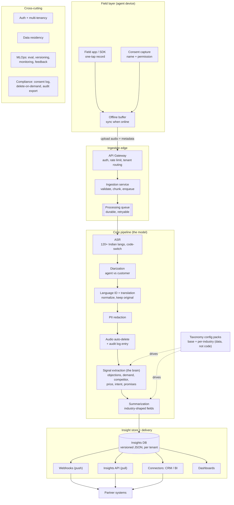
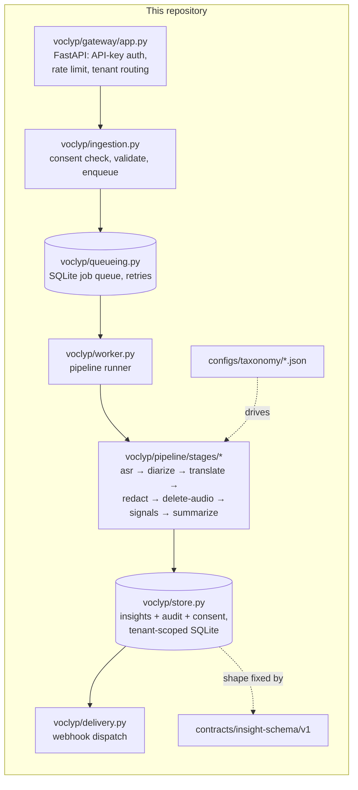
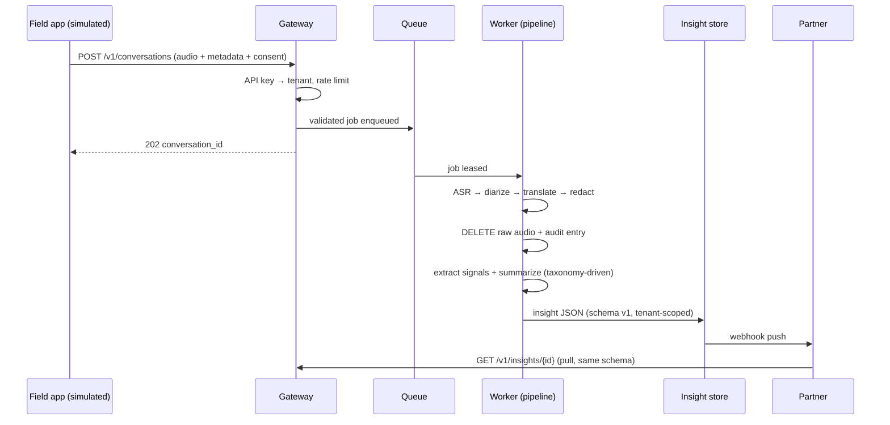

# VoClyp — Architecture (as implemented)

VoClyp is not a single AI model: it is a pipeline of specialized, swappable stages
wrapped in a platform. Partners integrate once against three stable contracts —
the gateway (the only way in), the versioned insight schema (the only way out),
and the taxonomy config (the only way to change industry behavior). Everything
between those contracts can be rebuilt freely.

## 1. Target system

Note one deliberate deviation from the original sketch: audio deletion sits
**inside** the pipeline, between redaction and signal extraction, as an explicit
stage. Analysis can never depend on raw audio because by the time analysis runs,
the audio no longer exists.

## 2. What is going to happen — Phase-0 implementation

Every box above exists in this repo today as a real module behind its real
interface; the AI stages are deterministic stubs that will be swapped for models
one at a time without changing anything around them.

### Sequence of one conversation

## 3. The three contracts

**Gateway API** — `POST /v1/conversations` (consent required), `GET /v1/insights`,
`GET /v1/insights/{conversation_id}`, `DELETE /v1/conversations/{id}`
(delete-on-demand), `POST /v1/webhooks`. Auth: `X-API-Key` mapped to a tenant;
every downstream operation carries that tenant id.

**Insight schema v1** — `contracts/insight-schema/v1/insight.schema.json`.
Versioned envelope: languages detected, redaction counts, extracted signals
(type, subtype, speaker, quote, turn, confidence), summary text + industry
fields, and an audit block proving audio deletion and recording stage versions.

**Taxonomy config** — `configs/taxonomy/base.json` defines the universal signal
types (objection, intent, demand, competitor_mention, price_reaction, promise).
Each industry pack (`fmcg.json`, `pharma.json`) maps its vocabulary onto those
types and declares its summary fields. Onboarding an industry = adding one file.

## 4. Tenancy, privacy, compliance

- `voclyp/store.py` exposes no query without a `tenant_id` parameter — isolation
  is structural, not conventional.
- Consent is required at submit time and logged; missing consent is a 4xx, not a warning.
- Audio deletion is a pipeline stage with an audit record; `DELETE /v1/conversations/{id}`
  wipes the stored insight on demand and audits that too.
- Every insight records the version of each stage that produced it (MLOps versioning seed).
