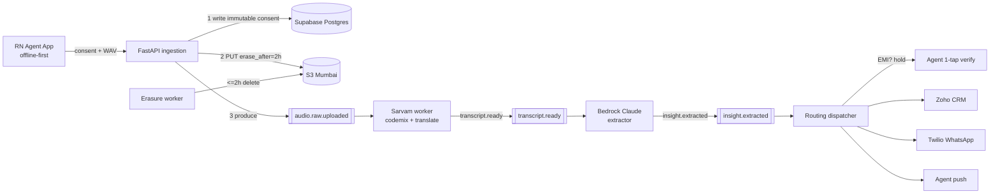
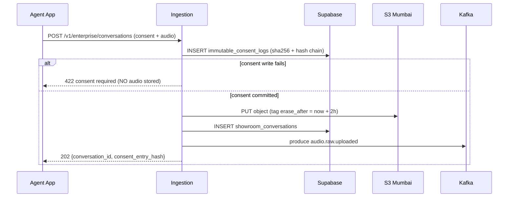

# VoClyp Enterprise Cloud Layer — Architecture

A net-new, **feature-flagged** cloud layer that lives entirely under
`voclyp/enterprise/`. It is **additive**: nothing in the existing demo pipeline
imports it, and with `VOCLYP_ENTERPRISE_ENABLED` unset the gateway behaves
exactly as before. Every external dependency (boto3, confluent-kafka, psycopg,
twilio, sarvamai) is optional — when a credential or library is missing, that
component degrades to an in-process mock so the whole flow still runs offline.

## End-to-end flow



## DPDP consent ordering (non-negotiable)



The immutable consent record is written **before** any audio reaches S3. If the
consent write fails, the request aborts and no audio ever leaves the device
boundary into cloud storage.

## Module layout (all under `voclyp/enterprise/`)

| Path | Responsibility |
| --- | --- |
| `config.py` | `EnterpriseSettings` — flags + AWS/Supabase/Kafka/Twilio/Zoho/Redis env. Everything off by default. |
| `store.py` | `PostgresStore` (Supabase/psycopg) and `LocalStore` (SQLite mirror) behind one interface. |
| `consent/service.py` | Canonical consent artifact → SHA-256 → per-tenant hash chain → immutable insert. |
| `storage/s3.py` | `S3AudioStore` (boto3, ap-south-1, `erase_after` tag + lifecycle) and `LocalAudioStore` mock. |
| `events/bus.py`, `events/topics.py` | `KafkaBus` + `InMemoryBus` (synchronous cascade for offline). Topic names. |
| `ingestion.py` | Consent-first → S3 → conversation row → `audio.raw.uploaded`. |
| `asr/sarvam_worker.py` | Dual transcript (codemix + translate), duration-based Batch vs REST + chunk fallback. |
| `extraction/schema.py` | JSON Schema Draft 2020-12 tool spec for Bedrock Converse. |
| `extraction/bedrock_worker.py` | Forced tool-use Converse call, confidence/EMI gating, mock heuristic extractor. |
| `routing/dispatcher.py` | Concurrent fan-out, `routing_outbox` retries, EMI verification hold. |
| `routing/{zoho,twilio_whatsapp,push}.py` | Channel clients (live + offline sink). |
| `erasure/worker.py` | Enforce ≤2h S3 deletion + audit. |
| `pipeline.py` | Assembles everything; wires in-memory subscriptions. |
| `router.py` | Flag-gated FastAPI endpoints (mounted from `gateway/app.py`). |
| `runner.py` | Standalone Kafka worker entrypoints. |

## State machine (`showroom_conversations.status`)

```
uploaded → transcribing → transcribed → extracting → extracted → routing → routed → erased
                     \                          \                       
                      └────────── failed ───────┘   (error_detail set)
```

`erased` can follow any terminal state once the erasure deadline passes; the raw
audio is destroyed but transcripts/insights are retained per policy.

## Two self-corrections wired in

1. **Hallucinated financials / EMI** — the extraction worker flags
   `requires_human_verification = true` whenever any `emi_commitments` are
   present **or** `overall_confidence` is below `VOCLYP_CONFIDENCE_THRESHOLD`.
   The routing dispatcher then creates the WhatsApp outbox row in status
   `held` (never auto-sent) and pushes a 1-tap verification request to the
   agent. `POST /v1/enterprise/conversations/{id}/verify` releases the hold.
2. **Sarvam 30s quota** — the ASR worker routes audio longer than 30s to the
   Sarvam Batch API; if Batch is unavailable it splits the WAV into ≤25s
   chunks, transcribes via REST, and stitches the results.

## Deliverable 1 — Bedrock extraction schema

See `voclyp/enterprise/extraction/schema.py`. `build_tool_config()` returns the
`toolConfig` passed to `bedrock-runtime.converse(...)` with
`toolChoice={"tool": {"name": "extract_showroom_intel"}}` to force constrained
decoding. The worker reads `output.message.content[].toolUse.input`.

## Deliverable 3 — Supabase schema

See `supabase/migrations/`:
- `0001_immutable_consent_logs.sql` — append-only (revoked UPDATE/DELETE + trigger), SHA-256 + hash chain.
- `0002_showroom_conversations.sql` — lifecycle, dual transcripts, extraction, erasure deadline.
- `0003_routing_outbox.sql` — per-channel at-least-once delivery rows.

Apply with the Supabase CLI (`supabase db push`) or `psql -f`.

## Running offline (no cloud creds)

```bash
export VOCLYP_ENTERPRISE_ENABLED=true
uvicorn voclyp.gateway.app:app
# POST audio to /v1/enterprise/conversations — the in-memory bus cascades
# ingest → ASR (mock) → Claude (heuristic) → routing (offline sinks) in-process.
```

See `python -m pytest tests/test_enterprise_pipeline.py` for an end-to-end
example with zero network access.
